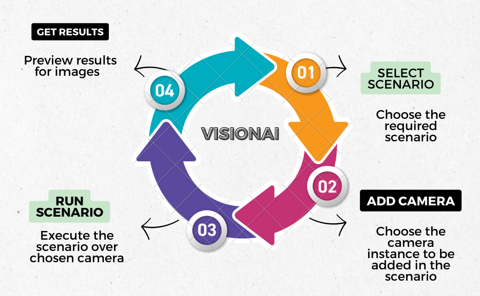

# **VisionAI**

Documentation for **VisionAI** toolkit.

<p align="center">
  <a href="https://docs.visionify.ai"></a>
</p>
<p align="center">
    <em>Ready to deploy Vision AI scenarios. Open source. Try our CLI now. </em>
</p>
<p align="center">
<a href="https://github.com/visionify/visionai/actions/workflows/codeql.yml" target="_blank">
    
</a>
<a href="https://github.com/visionify/visionai/blob/main/.github/workflows/docs.yaml" target="_blank">
    
</a>
<a href="https://dev.azure.com/visionify/workplace-safety/_build/latest?definitionId=5&branchName=main" target="_blank">
    
<a href="https://pypi.org/project/visionai" target="_blank">
    
</a>
</p>

---

## Overview
**VisionAI** provides a set of command line utilities for running Vision AI scenarios. We also have several industrial use-cases that are ready for production deployment. VisionAI is primarily a CLI (Command Line Interface) - but it also provides a Web-based GUI for managing your cameras. VisionAI is a developed by the team at **Visionify** - and is a part of the **Workplace Safety** suite of products.

Key features of **VisionAI** include:

- **Easy to use**: VisionAI is designed to be a no-code platform for deploying Vision AI solutions for common  workplace safety scenarios. The command-line interface (CLI) or Web interface are designed to be used by non-technical users as well as technical users.
- **Production Ready**: VisionAI provides a library of production-ready Workplace Safety scenarios that can be directly used out of the box. Each of these scenarios is trained from a large dataset of real-world images and videos.
- **Open Source**: VisionAI library is Open Source is available through GPLv3 license. You can use it for free and contribute to it as well. We also offer commercial licenses to enterprises that want to modify the codebase.
- **Custom Scenarios**: VisionAI can supports custom use-cases and scenarios. We have a flexible architecture based on NVIDIA triton server to serve multiple models, and common scenario pattern that can be used to easily add new use-cases. Check the customization documentation to get more information on how this can be achieved.
- **Integrations**: VisionAI currently integrates with REDIS PubSub and Azure Event hubs for alerts and notifications. We have roadmap plans to add support for other message brokers as well.
- **Cloud Ready**: VisionAI is available as as an Azure Marketplace offer. This provides scalable architecture for enterprise installations supporting a large number of cameras and scenarios.


## Scenarios

We support several Workplace health and safety scenarios. These are listed below. We are continuously adding new scenarios and you can [contact us](company/contact.md) if you need a scenario that is not listed here.

**VisionAI** focuses on workplace health and safety models - and majority of the models you see here have been developed with that in mind. We are continuously working on new scenarios - and our current scenario repo consists of over 60 scenarios that are listed [here](scenarios/index.md).


## Install **VisionAI**

## Quick Start

- Install **VisionAI** application through `PyPI`.

``` bash
$ pip install visionai
```

- Initialize visionai by running the following command. This would download the required dependencies on your setup. This might take a few minutes to complete as some of the dependencies are pretty large in size (1GB for Pytorch etc.)

``` bash
$ visionai init
```

- Once the initialization is successful, you can see the following output:

``` bash
$ visionai init
- - - - - - - - - - - - - - - - - - - - - - - - - - -
Grafana server is at: http://localhost:3003
Redis server is at: localhost:6379
Triton http server is at: http://localhost:8000
Triton grpc server is at: grpc://localhost:8001
Triton prometheus metrics server is at: http://localhost:8002/metrics
API server already running at: http://localhost:3002
Web server already running at: http://localhost:3001
```

- This indicates that different services required for running VisionAI are running on your machine.

| Service           | Port                     | Purpose                                         |
| :---------------- | :------------------------| :---------------------------------------------- |
| `Web UI`          | `http://localhost:3001`  | VisionAI Web-app                                |
| `Web API`         | `http://localhost:3002`  | VisionAI API service                            |
| `Triton HTTP`     | `http://localhost:8000`  | Triton Model server (http)                      |
| `Triton GRPC`     | `grpc://localhost:8001`  | Triton Model server (grpc)                      |
| `Triton Metrics`  | `http://localhost:8002`  | Triton Model metrics server (prometheus)        |
| `Redis`           | `redis://localhost:6379` | Redis server, currently supports PUBSUB         |
| `Grafana`         | `http://localhost:3003`  | Grafana server for charting & graphing          |

---


## VisionAI web app
- VisionAI also supports a web-based option for managing cameras, scenarios and pipeline. You can run the following command to start the web-based GUI. Once the web-based GUI is started, you can access it at http://localhost:3001.

``` bash
$ visionai web start

Web service API available at: http://localhost:3002
Web app available at: http://localhost:3001
```


- This would show an initial screen similar to this:

.

- You can manage cameras, scenarios, pipelines, see events etc., directly on the web-app. The web-app is running your own local compute instance. All the data is saved in your machine, and it is persistent as long as VisionAI application is not uninstalled.

- VisionAI supports out-of-box integration with Redis, Prometheus, Grafana and Azure Event Hub. Once the web-app is started, you can view the Grafana dashboard at: http://localhost:3003. The default username and password is `admin`/`admin`.

```
Grafana server is at: http://localhost:3003
Redis server is at: redis://localhost:6379
```


## List available **Scenarios**

**VisionAI** is organized in terms of scenarios. Consider each scenario as being a business use-case, that is solved by a combination of Machine Learning models and an inference algorithm. For example *Warn me when max occupancy of this area exceeds 80 people* is a business scenario, where as the *People detection* is an ML model.

**VisionAI** supports 60 scenarios currently and more are being added continuously. Our current focus is on Workplace Safety scenarios. Please [contact us](company/contact.md) if a scenario you need is not present in our repo and we will look into it.

- To list down available scenarios by running the following command.

``` bash
$ visionai scenarios list
```


## Get details for a **Scenario**

You can get details about a scenario using `visionai scenario details` command. Specify the scenario you want additional details for. The details of a scenario include the dataset size, model accuracy metrics.

<div class="termy">

```console
$ visionai scenario --name early-smoke-and-fire-detection details

------------------------------------------------
Category: Fire safety
Scenario: early-smoke-and-fire-detection
This scenario has been trained on open-source datasets consisting of 126,293 images. The datasets images are primarily outdoors (70%), but do contain a good number of indoor images (30%). There is a ~50-50% mix of day vs night images. You can find more details about this scenario at visionify.ai/early-smoke-and-fire-detection.


Model: smoke-and-fire-detection-1.0.1.pt
Model size: 127MB
Model type: Object Detection
Framework: PyTorch

Model performance:
Dataset size: 126,293 images
Accuracy: 94.1%
Recall: 93%
F1-Score: 93.5%

Events:
smoke-detected  | Immediate
fire-detected   | Immediate

Event examples:
{
    "scenario": "smoke-and-fire-detection",
    "event_name": "smoke-detected",
    "event_details": {
        "camera": "camera-01",
        "date": "2023-01-04 11:05:02",
        "confidence": 0.92
    }
}
------------------------------------------------

```

</div>

## Run a **Scenario**

Use `visionai scenario test` command to run a scenario. In its simplest sense, you can run a single scenario on your web-cam. In a more complex use-case, you can specify a pipeline of scenarios, configure notification logic for each scenario, timings for each scenario etc.



- Run a scenario by running the following command. This would run the scenario on your local web-cam.

``` bash
$ visionai scenarios test ppe-detection
```

- You can observe the command prompt for the output of the scenario. This scenario generates events when a person is detected without a PPE.

- You can also run this scenario on IP camera (RTSP, RTMP, RTP, HLS etc). For example:

``` bash
$ visionai scenarios test ppe-detection --camera rtsp://192.168.0.1:554/1
```

- You can also run this scenario on a video file. For example:

``` bash
$ visionai scenarios test ppe-detection --video /path/to/video.mp4
```

- You can also create a pipeline to run multiple scenarios on a single camera. For example:

``` bash
$ visionai camera add --name OFFICE-01 --url rtsp://192.186.0.1:554/1
$ visionai pipeline create --name test-pipeline --camera OFFICE-01
$ visionai pipeline add-scenario --name test-pipeline --scenario ppe-detection
$ visionai pipeline add-scenario --name test-pipeline --scenario face-blur
$ visionai pipeline add-scenario --name test-pipeline --scenario smoke-and-fire-detection
$ visionai pipeline start --name test-pipeline
```


## Deploy to **Azure**

Deploy a fully configured and tested solution directly from Azure Marketplace. **VisionAI** runs computer vision models, most of which run orders of magnitude faster if executed on a GPU machine. Our Azure Marketplace offer **VisionAI Community Edition** is available through Azure Marketplace [here](https://azure.microsoft.com) (TODO). The community edition deploys a fully configured Virtual Machine with the recommended hardware and software options.


- TODO: Point to ARM template that needs to be deployed (using these [instructions](https://learn.microsoft.com/en-us/azure/azure-resource-manager/templates/deploy-to-azure-button) and here is an example [JSON file](https://raw.githubusercontent.com/Azure/azure-quickstart-templates/master/quickstarts/microsoft.storage/storage-account-create/azuredeploy.json)).


## **Models**

To support the running various scenarios - VisionAI relies a set of Machine Learning models that have been specifically trained with Industrial use-cases datasets. These models must be served through NVIDIA triton framework. VisionAI makes serving these models easy through a single command-line interface:

``` bash
$ visionai models serve
```

Any time a new scenario is downloaded, the model server is automatically restarted to load and serve the new model. You can check the status of models being served by VisionAI through the following commands.

``` bash
$ visionai models list
```


Don't think you'll need to shut down the model server. However, if you do, you can do so through the following command.

``` bash
$ visionai models stop
```


## **Events**

VisionAI supports a variety of events that can be used to trigger actions. Our primary mode of events is through PubSub mechanism. VisionAI supports redis pubsub, and Azure Event Hub for posting events. These can be later extended to support emails alerts, SMS alerts, and other mechanisms.

Each event is in the form of a JSON object. The following is an example of an event that is posted when a smoke is detected by the smoke-and-fire-detection scenario.

```json
{
    "camera": "camera-01",
    "scenario": "smoke-and-fire-detection",
    "event_name": "smoke-detected",
    "event_details": {
        "camera": "camera-01",
        "date": "2023-01-04 11:05:02",
        "confidence": 0.92
    }
}
```

To listen to events, you can subscribe to the redis pubsub mechanism as follows:

```python

import redis
r = redis.Redis(host='localhost', port=6379, db=0)
p = r.pubsub()
p.subscribe('visionai')
for message in p.listen():
    print(message)

```


## Get **help** on commands

You can get more help on any command by adding --help at the end of the command. For example, if you want to get details about pipeline commands, you can run the following commands.

<div class="termy">

```console

$ visionai pipeline --help

 Usage: visionai pipeline [OPTIONS] COMMAND [ARGS]...

 Manage pipelines
 Pipeline is a sequence of preprocess routines and
 scenarios to be run on a given set of cameras. Each
 pipeline can be configured to run specific scenarios -
 each scenario with their own customizations for event
 notifications. This module provides robust methods for
 managing pipelines, showing their details, adding/remove
 cameras from pipelines and running a pipeline.

╭─ Options ────────────────────────────────────────────────╮
│ --help          Show this message and exit.              │
╰──────────────────────────────────────────────────────────╯
╭─ Commands ───────────────────────────────────────────────╮
│ add-camera      Add a camera to a pipeline               │
│ add-preprocess  Add a preprocess routine to a pipeline   │
│ add-scenario    Add a scenario to a pipeline             │
│ create          Create a named pipeline                  │
│ remove-camera   Remove a camera from a pipeline          │
│ reset           Reset the pipeline to original state.    │
│ run             Run a pipeline of scenarios on given     │
│                 cameras                                  │
│ show            Show details of a pipeline               │
╰──────────────────────────────────────────────────────────╯


```

</div>


## Next **steps**

Congratulations! You have successfully configured and used VisionAI toolkit. Now go through [Tutorials](tutorials/index.md) to learn about how to run multiple scnearios, how to configure each scenario for the events you need, how to set up pipelines with multiple cameras and scenarios.

Or you can also browse through our [scenarios](scenarios/index.md) section to understand different use-cases that are supported currently. If you have a need for a scenario, do not hesitate to submit a [request](https://github.com/visionify/visionai/issues) here.

## **Contributing**

We welcome contributions to VisionAI. Please read our [contribution guidelines](CONTRIBUTING.md) to learn about how you can contribute to VisionAI.

## **License**

VIsionAI is licensed under the [GPLv3 License](LICENSE.md). If you need a commercial license, please [contact us](company/contact.md).


