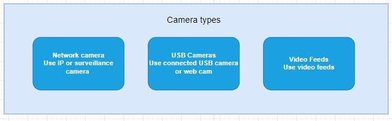
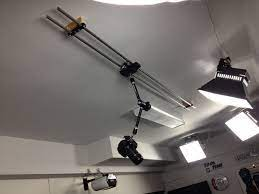

# Camera 

> Use your existing camera to integrate with VisionAI platform 

## What Cameras can I use?
Cameras that can be used with VisionAI app would be:

 - *IP cameras*

    Use the video feed from a single or a network of digital video security cameras. These could be common security cameras (CCTV) or network cameras (IP cameras) connected to the same network as the edge device (computer).  We offers integration for IP cameras.

- *USB cameras or webcams*

    Utilize webcams or USB cameras to process AI models.
    
The common video output formats are MPEG, WMV, or MPEG-4. RTSP, HTTP, and HTTPS are frequently used protocols for sharing live broadcast streams.
    

## Camera Placement Guidelines

When positioning cameras for various use situations, take into account the following general guidelines: 

1. Lighting: Install cameras underneath a light fittings so that they do not obscure the cameras.

2. Backlighting: Avoid mounting cameras near to window or other areas to protect from backlighting issue. It affects image quality.

3. Local policies: Take into account local placement policies and laws.

4. Authorization: The installation of cameras should be authorized by a designated person or department within the organization. 

5. Maintenance: Cameras should be regularly maintained and checked to ensure they are functioning properly. The policy should specify who is responsible for maintaining the cameras and how often they should be checked.

!!! note
    Overall, it's important to develop local policies for camera mounting that balance the need for surveillance with the protection of privacy rights. The policies should be reviewed and updated regularly to ensure they remain relevant and effective.

## Camera View

The camera view refers to the field of vision captured by a camera. The camera view is determined by the placement of the camera and its angle of view.

When considering camera view, it's important to think about the following:

=== "Camera Front View"
    A camera front view refers to the perspective captured by a camera facing forward, usually at a person's eye level or slightly higher. This type of camera view is commonly used in areas where it's necessary to monitor and identify individuals.
    When positioning a camera for front view, there are several factors to consider:
    ??? Factors
        - *Purpose*: Determine the purpose of the camera view. 

        - *Height*: The camera should be positioned at a height that allows for a clear view of the face and upper body of the person being monitored. The camera should be at or slightly above eye level.

        - *Angle*: The camera angle should be adjusted so that it's facing straight ahead or slightly downward to capture clear images of individuals' faces.

        - *Lighting*: Proper lighting is crucial for capturing clear images. Ensure that there is adequate lighting in the area where the camera is positioned.

        - *Field of View*: Determine the area that needs to be monitored and the degree of coverage required. The field of view will depend on the type of camera, its lens, and its angle of view.

        Overall, careful consideration of camera height, angle, lighting, field of view, and privacy concerns can help ensure that a camera front view provides clear and useful images for its intended purpose.

    The following illustration provides simulations for the camera front views.
 

    Example 3             |  Example 4
    :-------------------------:|:-------------------------:
      |  

=== "Camera Ceiling View"

    A camera mounted on the ceiling can provide a wide and unobstructed view of the surrounding area. This type of camera view can be particularly useful in large indoor spaces.

    When positioning a camera for ceiling view, there are several factors to consider:

    ??? Factors
        
        - *Camera type*: Choose a camera that is specifically designed for ceiling mounting. These cameras usually have a dome shape and can be either fixed or adjustable in terms of angle.

        - *Camera angle*: Determine the best angle for the camera based on the specific area you want to monitor. The camera should be positioned to provide a clear view of the entire area without any blind spots.

        - *Height*: The camera should be mounted high enough to avoid tampering or obstruction, but low enough to capture detailed images of individuals and objects in the area.

        - *Lighting*: Consider the lighting conditions in the area where the camera will be installed. If the area is poorly lit, additional lighting may be needed to ensure clear images.

        - *Wiring*: Ensure that there is a power source and wiring available for the camera. Consider whether it will be necessary to run wiring through the ceiling or walls.

        Overall, a camera mounted on the ceiling can provide an effective way to monitor large indoor spaces. Careful consideration of camera type, angle, height, lighting, wiring, and privacy concerns can help ensure that the camera provides clear and useful images while respecting privacy rights.

    The following illustration provides simulations for the camera ceiling views.

    
    Example 1             |  Example 2
    :-------------------------:|:-------------------------:
      |  

