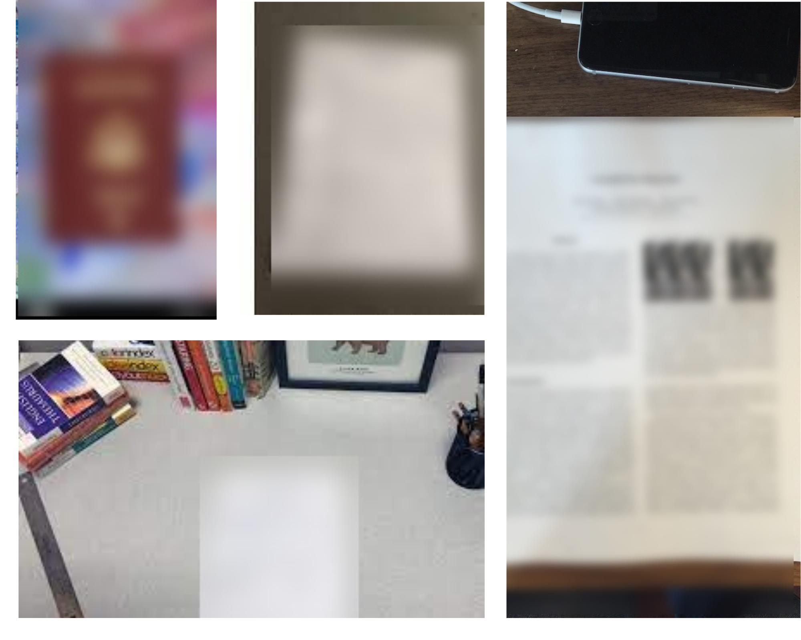

# **Document blur** 

> Ensure the privacy of individuals by obscuring documents and other text in camera feeds



## Overview

Blurring documents and other text is a common technique used to protect the privacy of individuals in images and videos.
A computer vision-based model is used in the process to make the characters on a document/text unreadable.

Blurring documents can be an effective way to protect sensitive information and preserve privacy. By blurring or obscuring sensitive information on a document, you can help prevent others from accessing confidential information or using the information for malicious purposes.

Document blurring technology can be relatively easy to use and understand. The algorithm detects documents/text in the scene and blurs them. The tool can be used on images as well as on videos.

## Vision AI-based monitoring 

Vision AI-based model for document blurring can be particularly useful when sharing documents containing personally identifiable information (PII), such as social security numbers, driver's license numbers, and financial account numbers. It can also be useful when sharing documents that contain trade secrets, confidential business information, or other sensitive data that could be used to harm individuals or organizations.

The model uses a detection algorithm followed by computer vision techniques to obscure texts in images and videos. The model works in a way that it ensures that documents are fully and effectively obscured so that it cannot be read or easily recovered by others.

There are many use cases for document blurring, where blurring or obscuring sensitive information can help protect privacy and prevent unauthorized access to sensitive data. Here are some common use cases:

- Redacting personal information in legal documents: Legal documents often contain sensitive information, such as social security numbers, addresses, and birth dates. By blurring or redacting this information, legal professionals can help protect their clients' privacy and prevent identity theft.

- Blurring confidential business information in corporate documents: Corporate documents, such as financial reports and contracts, often contain confidential business information. Blurring or redacting this information can help protect the company's intellectual property.

- Blurring identifying information in online images: Online images, including social media posts and blog articles, often include identifiable information. By blurring this information, content creators can help protect the privacy of individuals.

- Blurring confidential information in government documents: Government documents, including classified information and sensitive documents, often require blurring or redaction to prevent unauthorized access to confidential information.

### Dataset 

The dataset for this scenario consists of images and videos with different types of documents.
It is constructed in a manner to reflect real-world intricacies.
The dataset has documents with:

- Variations in the environment
- Different types of documents
- Different distances from the camera
- Different lighting conditions
- Various camera angles and resolutions
- Using security camera feeds

### Model 

The model is based on the YOLOv5 algorithm to detect documents. Document/text blurring is performed using computer vision-based blurring algorithms. The model is developed in a way that it generalizes well for different environments and situations.

The document blurring model based on Yolov5 recorded the following performance metrics:


<div class="table">
    <table class="fl-table">
        <thead>
        <tr><th>Model Name</th>
            <th>Precision</th>
            <th>Recall</th>
            <th> mAP  </th>  
        </thead>
        <tbody>
        <tr>
            <td>DOCUMENT BLUR</td>
            <td>97.4% </td>
            <td>97.5% </td>
            <td>99.1% </td>
        </tr>
        </tbody>
    </table>
</div>

The model is adaptable enough to run on any edge computing device.

### Scenario details

The business logic for this scenario is as follows: 

- We use existing camera feeds from the premises to ensure the privacy of individuals.
- VisionAI system is able to run on edge devices. It uses camera feeds for processing. 
- We detect and blur the documents identified in this camera feed.

## Try it now

### Quick method - using your local web-cam

To test this model & scenario, you can use the following steps:

- Install the visionai package from PyPI

<div class=termy>

```console

$ pip install visionai
---> 100%
```
</div>

- Test the scenario from your local web-cam

<div class=termy>

```console
$ visionai scenario test doc-blur

Downloading models for scenario: doc-blur Model: doc-blur: https://workplaceos.blob.core.windows.net/models/yolov5s-people/yolov5s-people-0.0.4.zip
---> 100%

Starting scenario: doc-blur..

```
</div>

### In an actual environment

To use this scenario in an actual environment, you can follow these steps:

- Install the visionai package from PyPI

<div class=termy>

```console
$ pip install visionai
---> 100%
```
</div>

- Download the scenario

<div class=termy>

```console
$ visionai scenario download doc-blur

Downloading models for scenario: doc-blur
Model: doc-blur
https://workplaceos.blob.core.windows.net/models/yolov5s-people/yolov5s-people-0.0.4.zip
---> 100%
```

</div>

- Add the camera feed to the scenario

<div class=termy>

```console
$ visionai camera add OFFICE-01 --url rtsp://192.168.0.1/stream1
$ visionai camera OFFICE-01 add-scenario doc-blur
$ visionai run

Starting scenario: doc-blur..

```

</div>

For more details visit VisionAI [web application](https://visionify.ai/)

## Training with custom data

The scenario is provided as part of our GPL-v3 Open-Source package for VisionAI. If you wish to train this with custom datasets, please contact us and we can provide you with the training code. You can do custom training with your own datasets for free, as long as it complies with the GPLv3 license (you give back the code to the community). If you are interested in a custom license, please (contact us)[contact.md].

## Contact Us

- For technical issues, you can open a Github issue [here](https://github.com/visionify/visionai).
- For business inquiries, you can contact us through [our website](https://visionify.ai/contact).


