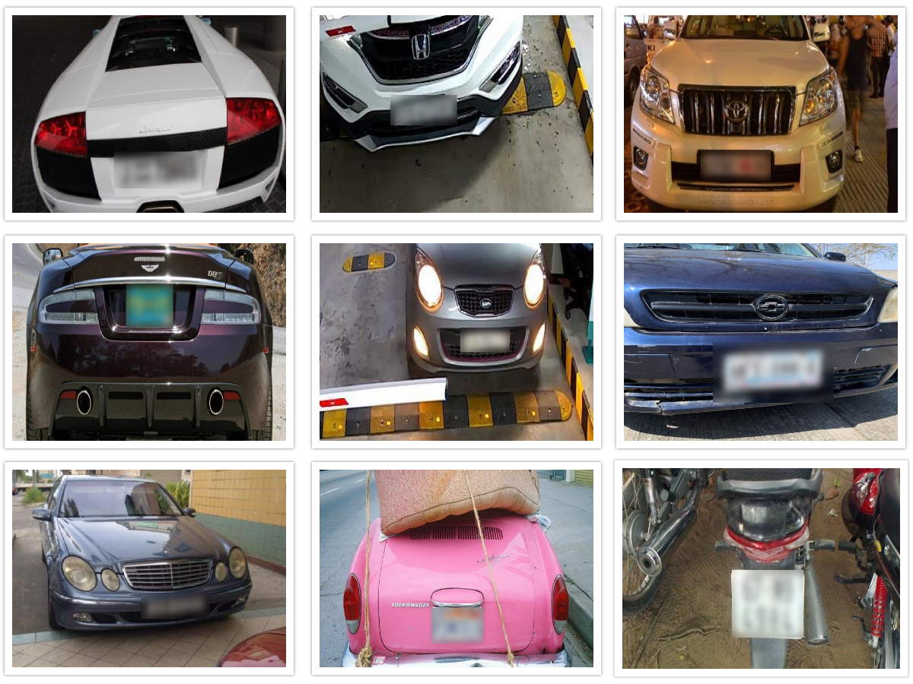

# **Licence  Plates blur** 

> Ensure the privacy of vehicle owners in images and videos by blurring licence plates



## Overview

Blurring license plates is a common technique used to protect the privacy of vehicle owners in images and videos.
The process involves using computer vision based model to obscure the alphanumeric characters on a license plate, making them unreadable.

Blurring license plates can be an effective way to protect the privacy of vehicle owners, particularly in situations where their vehicles may be captured on camera without their knowledge or consent. This can include surveillance footage, dashcam footage, or even photographs taken by bystanders.

Licence plate blurring technology can be relatively easy to use and understand. The algorithm detects licence plates and blurs them. The tool can be used on images as well as on videos.

## Vision AI-based monitoring 

Vision AI-based model for license plate blurring can be a useful and intended application in certain contexts, such as when capturing images or video in public places or in situations where license plates may contain sensitive or identifying information. This technology can help protect the privacy and security of individuals by blurring or obscuring license plate numbers.

The model uses a detection algorithm followed by computer vision techniques to obscure licence plates in images and videos. This model has been can be used for various applications including privacy protection, surveillance or investigation operations.

Overall, license plate blurring models have a range of applications in various industries, all of which aim to protect individual privacy and prevent the misuse of sensitive information.

### Dataset 

The datasets for this scenario is consists of images and videos with licence plates.
It is compiled in a manner to reflect real-world complexities.
The dataset has licence plaes with:

- Variations in the environment
- Different seasonal changes
- Different types of vehicles
- Different distances from the camera
- Different lighting conditions
- Various camera angles and resolutions
- Using security camera feeds

Total number of images used was 23,219.

### Model 

The model is based on the YOLOv5 algorithm to detect licence plates. It is trained on the curated dataset. Licence plate blurring is performed using computer vision-based blurring operations. The model is developed in a way that it generalizes well for different environments and situations.

The licence plate detection model based on Yolov5 recorded the following performance metrics:

<div class="table">
    <table class="fl-table">
        <thead>
        <tr><th>Model Name</th>
            <th>Precision</th>
            <th>Recall</th>
            <th> mAP  </th>  
        </thead>
        <tbody>
        <tr>
            <td>LICENSE PLATE BLUR</td>
            <td>97.4%  </td>
            <td>96.3%  </td>
            <td>98.4%  </td>
        </tr>
        </tbody>
    </table>
</div>


The model is adaptable enough to run on any edge computing device.

### Scenario details

The business logic for this scenario is as follows: 

- We use existing camera feeds from the premises to ensure the privacy of vehicle owners.
- VisionAI system is able to run on edge devices. It uses camera feeds for processing. 
- We detect and blur the licence plates identified in this camera feed.

## Try it now

### Quick method - using your local web-cam

To test this model & scenario, you can use the following steps:

- Install the visionai package from PyPI

<div class=termy>

```console

$ pip install visionai
---> 100%
```
</div>

- Test the scenario from your local web-cam

<div class=termy>

```console
$ visionai scenario test licence-plate-blur

Downloading models for scenario: licence-plate-blur Model: licence-plate-blur: https://workplaceos.blob.core.windows.net/models/yolov5s-people/yolov5s-people-0.0.4.zip
---> 100%

Starting scenario: licence-plate-blur..

```
</div>

### In an actual environment

To use this scenario in an actual environment, you can follow these steps:

- Install the visionai package from PyPI

<div class=termy>

```console
$ pip install visionai
---> 100%
```
</div>

- Download the scenario

<div class=termy>

```console
$ visionai scenario download licence-plate-blur

Downloading models for scenario: licence-plate-blur
Model: licence-plate-blur
https://workplaceos.blob.core.windows.net/models/yolov5s-people/yolov5s-people-0.0.4.zip
---> 100%
```

</div>

- Add the camera feed to the scenario

<div class=termy>

```console
$ visionai camera add OFFICE-01 --url rtsp://192.168.0.1/stream1
$ visionai camera OFFICE-01 add-scenario licence-plate-blur
$ visionai run

Starting scenario: licence-plate-blur..

```

</div>

For more details visit VisionAI [web application](https://visionify.ai/)


## Training with custom data

The scenario is provided as part of our GPL-v3 package for VisionAI. If you wish to train this with custom datasets, please contact us and we can provide you with the training code. You can do custom training with your own datasets for free, as long as it complies with the GPLv3 license (you give back the code to the community). If you are interested in a custom license, please (contact us)[contact.md].

## Contact Us

- For technical issues, you can open a Github issue [here](https://github.com/visionify/visionai).
- For business inquiries, you can contact us through [our website](https://visionify.ai/contact).

