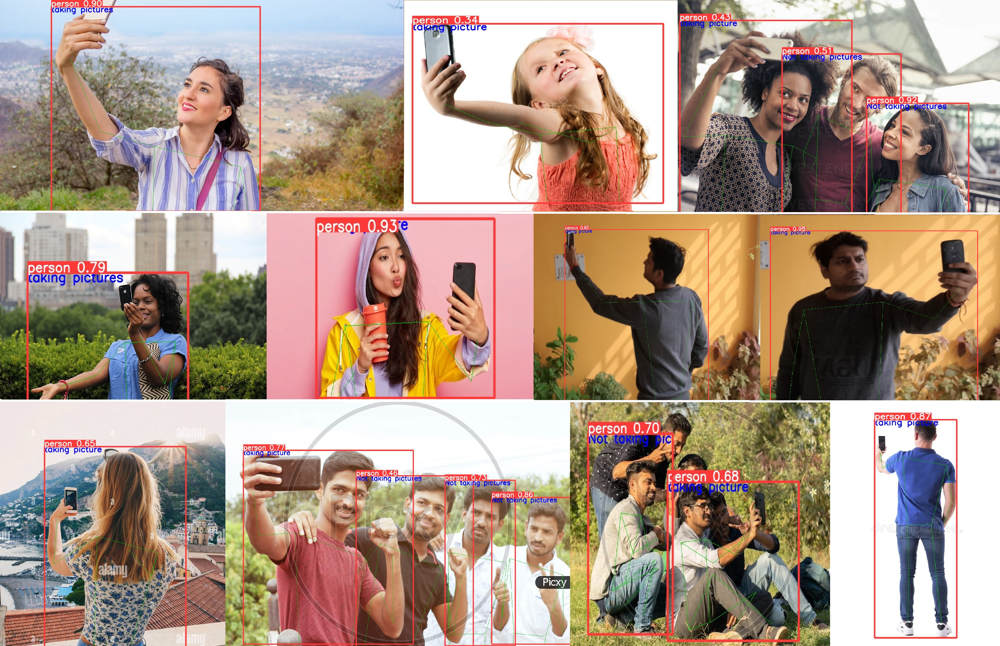

# **People Taking Picture Detection**

> Get real-time alerts when workers are taking pictures at the workplace, a monitoring system that can detect camera usage on company-owned devices or company networks.



## Overview
The usage of mobile phones at workplaces can have serious consequences. Other than the distraction they cause, these devices prove to be a powerful and insidious way to execute malicious purposes. Their small size and sophisticated features make them an effective tool for espionage. Many companies experience the loss or theft of sensitive data due to their employees' careless or intentional use of mobile devices. Detection of mobile phone usage in organizations can help companies avoid any harmful or haphazard use cases. Manual ways to detect mobile phone usage are neither cost-effective nor scalable.


## Vision AI based monitoring

Vision AI based monitors can be used to safely detect mobile phone usage (people taking pictures, recording or streaming videos/audios, sending texts in prohibited areas) by providing real-time video feeds of the area. These cameras can be used to detect an event of workers taking pictures in prohibited areas.


Enforce any company policies on picture-taking in the workplace.
These camera based detection processes should be supplimented by strong compliance practices. If workers are prohibited from taking pictures, ensure that they are aware of the policy and the consequences of violating it.So, if a worker is found to be taking unauthorized pictures, appropriate action can be taken.


## Model Details

### Dataset
Model training is carried out with Microsoft COCO: Common Objects in Context dataset. Person class is considered for model building. 

Basically, COCO is a  large-scale dataset and it provides real-world data representation including:

- Indoor vs Outdoor environments
- Male vs Female
- Day vs Night
- Different types of clothing
- Different distances from the camera
- Various lighting conditions
- Various camera angles and resolutions
- Using seurity camera feeds


### Model
The model is built using Yolov5 pre-trained model for person and mobile classes. The yolov5 model is used to identify the human body landmarks of the subject. By considering the angle difference in the movement of body parts, people taking picture event is detected.

The Yolov5 model provides the following metrics:


<div class="table">
    <table class="fl-table">
        <thead>
        <tr><th>Model Name</th>
            <th>Precision</th>
            <th>Recall</th>
            <th> mAP  </th>  
        </thead>
        <tbody>
        <tr>
            <td>PERSON DETECTION</td>
            <td>84.0% </td>
            <td>85.1% </td>
            <td>81.5% </td>
        </tr>
        </tbody>
    </table>
</div>


and landmark detection model gives the following metrics:

<div class="table">
    <table class="fl-table">
        <thead>
        <tr><th>Model Name</th>
            <th>Precision</th>
            <th>Recall</th>
            <th> mAP  </th>  
        </thead>
        <tbody>
        <tr>
            <td>LANDMARK DETECTION</td>
            <td>84.0% </td>
            <td>72.8% </td>
            <td>84.9% </td>
        </tr>
        </tbody>
    </table>
</div>

The model is light-weight enough to be run on any edge devices.

### Scenario details

The business logic for this scenario is as follows:
- We use existing camera feeds from the premises to detect a worker taking picture in unauthorized areas .
- VisionAI system is run at the edge. It uses the camera feeds for processing.
- We detect the picture taking event and an alert is raised.

## Try it now 

### Quick method - using your local web-cam

To test this model & scenario, you can use the following steps:

- Install the visionai package from PyPI

<div class=termy>

```console
$ pip install visionai
---> 100%
```
</div>

- Test the scenario from your local web-cam

<div class=termy>

```console
$ visionai scenario test people-taking-picture-detection

Downloading models for scenario: people-taking-picture-detection
Model: people-taking-picture-detection: https://workplaceos.blob.core.windows.net/models/yolov5s-people/yolov5s-people-0.0.4.zip
---> 100%

Starting scenario: people-taking-picture-detection..

```
</div>


- You should be able to see the events generated on your console window with people taking picture being detected within the camera field of view.

### In an actual environment

To use this scenario in an actual environment, you can follow these steps:

- Install the visionai package from PyPI

<div class=termy>

```console
$ pip install visionai
---> 100%
```
</div>

- Download the scenario

<div class=termy>

```console
$ visionai scenario download people-taking-picture-detection

Downloading models for scenario: ergonomics-detection
Model: people-taking-picture-detection
https://workplaceos.blob.core.windows.net/models/yolov5s-people/yolov5s-people-0.0.4.zip
---> 100%
```

</div>

- Add the camera feed to the scenario

<div class=termy>

```console
$ visionai camera add OFFICE-01 --url rtsp://192.168.0.1/stream1
$ visionai camera OFFICE-01 add-scenario ergonomics-detection
$ visionai run

Starting scenario: people-taking-picture-detection..

```

</div>

- You should be able to see the events generated on your console window with people taking picture being detected within the camera field of view.

For more details visit VisionAI web applicaion.

## Training with custom data

The scenario is provided as part of our GPL-v3 package for VisionAI. If you wish to train this with custom datasets, please contact us and we can provide you with the training code. You can do custom training with your own datasets for free, as long as it complies with GPLv3 license (you give back the code to the community). If you are interested in a custom license, please (contact us)[contact.md].

## Contact Us

- For technical issues, you can open a Github issue [here](https://github.com/visionify/visionai).
- For business inquiries, you can contact us through [our website](https://visionify.ai/contact).