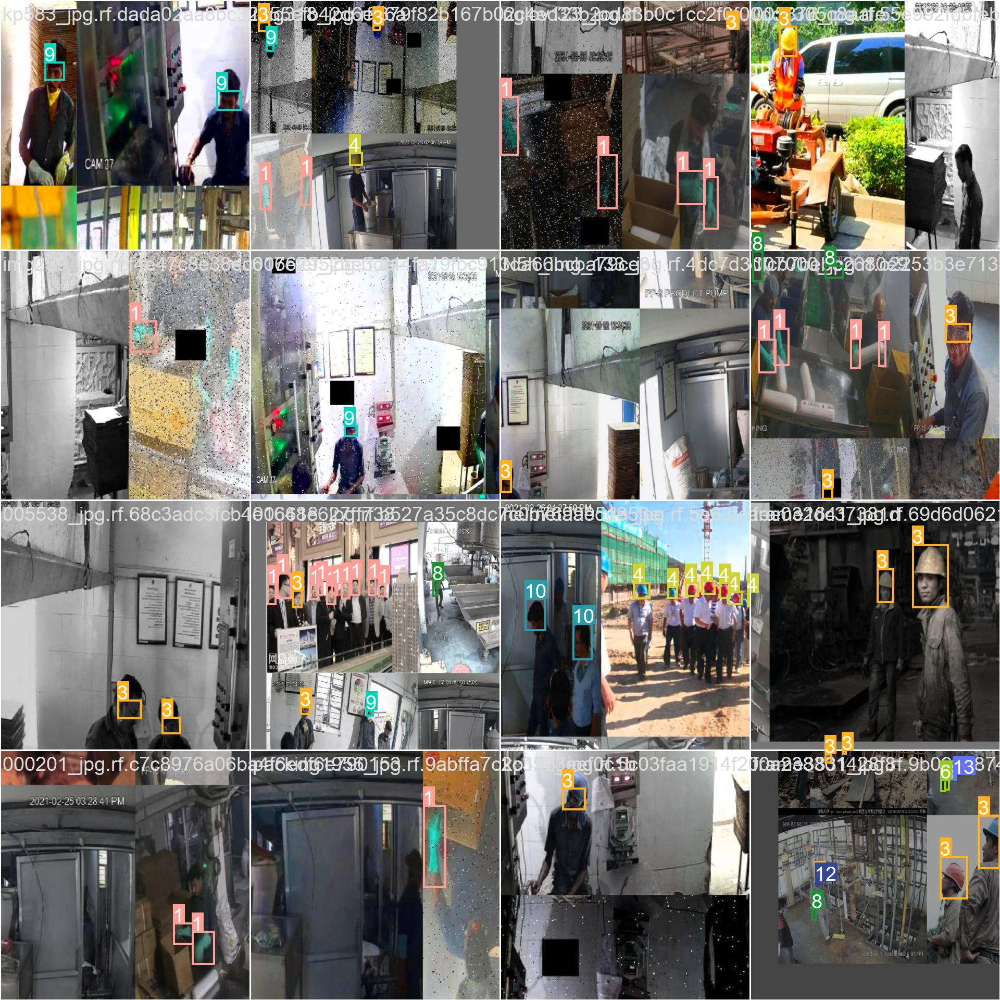

# PPE Detection

> Prevent Workplace Injuries and Occupational Hazards with Vision AI



## Overview

Personal protective equipment, or "PPE," is the clothing worn to reduce exposure to risks that might result in significant workplace diseases and injuries. Contact with chemical, radioactive, physical, electrical, mechanical, or other job hazards may cause these wounds and illnesses. Items like gloves, safety goggles, shoes, earplugs or muffs, hard hats, respirators, coveralls, vests, and full-body suits are examples of personal protection equipment. Accidents and injuries due to employees not wearing PPE hold business owners/employers legally accountable. Apart from legal damages, accidents due to PPE negligence result in loss of time, reduced productivity, costly worker compensations, etc.  

- Workplace Fatalities are rising, and employers cannot afford to tolerate PPE negligence. According to the Bureau of Labor Statistics, there were 5,190 fatal work injuries recorded in the United States in 2021, an 8.9-percent increase from 4,764 

- Speaking about one of the most injury-susceptible body parts - hands, OSHA reports that almost 70 percent of hand and arm injuries could be prevented with personal protective equipment, specifically safety gloves. Yet, 70 percent of workers don’t wear hand protection, and 30 percent don’t wear the right kind of glove for the task. 

- If we consider one of the leading causes of workplace fatalities - Head Injuries a study by BLO found that 84% of head injuries at a worksite were due to the absence of safety helmets. A percentage which not small considering there were 68,170 head injuries in 2021 

Therefore, complete compliance is necessary since even a brief lapse in usage can prove fatal. To monitor PPE compliance, cameras can be used. 

## Vision AI based monitoring 

Vision AI based monitors can be used to monitor PPE compliance by providing real-time video feeds of the factory unit. The cameras scan every frame to ensure there's no PPE negligence, eliminating occupational hazards and serious injuries. 

To ensure accuracy and reliability, these camera-based monitoring services should be supplemented by strong compliance processes. Furthermore, workers working in different factory units should always be made aware of PPE compliance practices. 


## Model Details

### Dataset 

The dataset for this scenario is based on PPE detection algorithms that are currently in practice.  

The dataset is made up of images and videos gathered from various sources. The dataset has been catalogued to ensure real-world intricacies. It has an even distribution of: 

- Different(indoor/outdoor) environments 
- Male vs Female  
- Variations in PPE suits 
- Variations in gloves, helmet, goggles, safety-vest design 
- Different light settings 
- Variations in camera orientations  
- Using security camera feeds 
- Total number of images used was 207,300

### Model 

The model is based off of the YOLOv5 algorithm. The model is trained on a custom dataset of images and videos. The model is trained based on the above dataset compiled by our team. 

The model provides the following metrics: 

|Precision|	Recall	|mAP	|
|---------|---------|-------|
|88.6%	  |86.4%    |91.2%  |


The model is adaptable enough to run on any edge computing device. 

## Scenario details 

The business logic for this scenario is as follows: 

- We use existing camera feeds from the premises to monitor the compliance of PPE in the workplace. 
- VisionAI system is able to run on edge devices. It uses camera feeds for processing. 
- We detect people in the camera feed and we monitor whether the person is wearing safety gloves, goggles, helmet, mask, safety-shoes and vest or not. 
- If the person is detected without safety gloves, goggles, helmet, mask, safety-shoes and vest, an alert is raised.


## Try it now

### Quick method - using your local web-cam

To test this model & scenario, you can use the following steps:

- Install the visionai package from PyPI

<div class=termy>

```console
$ pip install visionai
---> 100%
```
</div>

- Test the scenario from your local web-cam

<div class=termy>

```console
$ visionai scenario test ppe-detection

Downloading models for scenario: ppe-detection
Model: ppe-detection: https://workplaceos.blob.core.windows.net/models/yolov5s-people/yolov5s-people-0.0.4.zip
---> 100%

Starting scenario: ppe-detection..

```
</div>


- You should be able to see the events generated on your console window with the detections of safety gloves, goggles, helmet, mask, safety-shoes and vest within the camera field of view.

### In an actual environment

To use this scenario in an actual environment, you can follow these steps:

- Install the visionai package from PyPI

<div class=termy>

```console
$ pip install visionai
---> 100%
```
</div>

- Download the scenario

<div class=termy>

```console
$ visionai scenario download ppe-detection

Downloading models for scenario: ppe-detection
Model: ppe-detection
https://workplaceos.blob.core.windows.net/models/yolov5s-people/yolov5s-people-0.0.4.zip
---> 100%
```

</div>

- Add the camera feed to the scenario

<div class=termy>

```console
$ visionai camera add OFFICE-01 --url rtsp://192.168.0.1/stream1
$ visionai camera OFFICE-01 add-scenario ppe-detection
$ visionai run

Starting scenario: ppe-detection..

```

</div>

- You should be able to see the events generated on your console window with the detections of safety gloves, goggles, helmet, mask, safety-shoes and vest within the camera field of view.

### Through VisionAI Web-Application


You can also use the VisionAI web-application to manage your cameras & scenarios. You can use the following steps:

- Install the visionai package from PyPI

<div class=termy>

```console
pip install visionai
---> 100%
```

</div>


- Run the VisionAI web-application

<div class=termy>

```console
$ visionai web start

Starting VisionAI web-application..

```

</div>

- This opens up a web-app that you can use to manage your cameras & scenarios. First add the camera feed to the system and check if it is working.

### Add camera

Click on add camera button and fill the details.

Then click on create to add new camera.


Once the camera is added, you can add the scenario to the system. Search for "ppe detection" and add it to the camera.

PPE Detection comes as part of your search then click on "GET THIS".


Now select the cameras to which you wish to apply the PPE detection.

   


Click on apply button


- You should be able to see the events generated on your console window with the detections of safety gloves, goggles, helmet, mask, safety-shoes and vest within the camera field of view.


### Using Azure Managed Service App
1. From Azure Market Place, search and select Visionai. Enter project details in the following screen. Click on Next. 

    

2. Verify all the settings and click on review+create.

    

3. Once validation is passed, Click on create.

    


## Events Supported 

This scenario supports the following event: 
 

- **PPE detected**: This event is generated when a PPE including goggles, gloves, helmet, mask, safety-shoes, vest, etc. are detected in the camera feed. 

- For example: Person Detected without Helmet
```
{
    event_name: 'person_without_helmet',
    datetime: '2022-12-27 13:58:19.445956',
    camera: 'OFFICE-01',
    image: "https://image_without_helmet0707365572.blob.core.windows.net/ppe-detection-microsoft-ivs",
    detections: [
        [124.0, 10.0, 662.0, 352.0]
    ]
}
```

- For example: Person Detected without Goggles
```
{
    event_name: 'person_without_helmet',
    datetime: '2023-02-07 18:34:09.430322', 
    camera: 'OFFICE-04',
    image: "https://image_without_googles539365972.blob.core.windows.net/ppe-detection-microsoft-ivs",
    detections: [
        [138.5, 18.0, 589.0, 298.0]
    ]
}
```


## Why PPE compliance is necessary

- Accidents and injuries that take place due to an employee not wearing PPE holds business owners/employers accountable legally
- Injuries and accidents that result from not wearing PPE results in lost time, reduced productivity, costly worker compensations, etc.
- According to OSHA, the proper use of PPE can prevent 37.6% of occupational injuries and diseases.
- 12%–14% of occupational injuries resulting in total disability are caused by employees not wearing appropriate PPE
- Workplace Fatalities are on the rise and employers cannot afford to tolerate PPE negligence. According to the Bureau of Labor Statistics, there were 5,190 fatal work injuries recorded in the United States in 2021, an 8.9-percent increase from 4,764
- Speaking about one of the most injury-susceptible body parts - hands, OSHA reports that almost 70 percent of hand and arm injuries could be prevented with personal protective equipment, specifically safety gloves. Yet, 70 percent of workers don’t wear hand protection, and of those who do, 30 percent don’t wear the right kind of glove for the task.
- If we consider one of the leading causes for workplace fatalities - Head Injuries a study by BLO found out that 84% of head injuries at a worksite were due to absence of safety helmets. A percentage which not small considering there were 68,170 head injuries in 2021


## Technical challenges faced by PPE Detection systems in the market

### Low Accuracy

When it comes to PPE detection systems that work with visual inputs, accuracy is a major issue in the industry. This is due to variations in lighting, background, and the appearance of PPE itself (e.g., different colors and styles).

### Speed

Creating optimum Real-time processing systems that are cost-effective is major challenge

### High rates of False positives and False Negatives

Minimizing false-positives and false negatives in such systems is another challenge faced by the industry. Errors and inaccurate detections can have serious consequences for a workplace.

### Scalability

Be it cost-effectiveness, managing occlusions/poor image quality or covering all segments of a workplace, proper scalability of a computer Vision system to detect PPE in real-time is not feasible for many solutions providers.


## Training with custom data

The scenario is provided as part of our GPL-v3 Open-Source package for VisionAI. If you wish to train this with custom datasets, please contact us and we can provide you with the training code. You can do custom training with your own datasets for free, as long as it complies with GPLv3 license (you give back the code to the community). If you are interested in a custom license, please (contact us)[contact.md].

## Contact Us

- For technical issues, you can open a Github issue [here](https://github.com/visionify/visionai).
- For business inquiries, you can contact us through [our website](https://visionify.ai/contact).