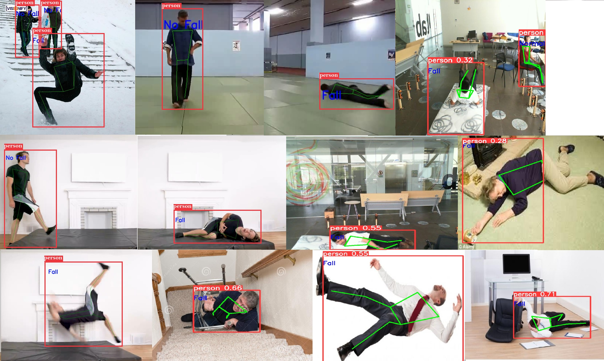

# **Slip and Fall Detection** 
> Ensure the safety of employees by inspecting slip and fall instances. Get real-time alerts when such kind of accidents occur at the workplace. 



## Overview

Slip and Falls are among the leading causes of occupational fatalities. Timely action in the event of a Fall/Slip accident can minimize damage and save lives. However, working alone or in a noisy environment hinders timely assistance.  

Here are some situations where a slip-fall detection system would be useful. 

- Construction sites: Detect slips and falls among workers and alert supervisors to potential hazards. Potential deployment zones include ladders, ramps, and scaffolds.  

- Working at heights: Falls from higher to lower levels are the most common cause of fatalities in Slip and Fall accidents, making Slip and Fall detection for workers at height vital. 


- Working Alone: Slip and Fall detection is crucial for specific job settings where employees are required to work alone, particularly during off-hours. Deployment areas could be for the following category of workers. 

- Construction Sites: Electricians, plumbers, and HVAC (Heating, ventilation, and air conditioning) technicians work alone on specific tasks where slip and fall would be useful. 

- Oil and gas: The system will be useful for remote location workers such as drill operators, pipeline inspectors, and pump operators working in oil and gas mining regions. 

- Telecommunications: Workers such as tower climbers and cable technicians often work alone at high-rise towers and other elevated locations and their safety can be ensured by slip and detection system. 

- Mining Industry: Workers such as underground miners and drill operators often work alone in remote and confined spaces. 

- Maintenance: Building engineers, window cleaners, painters, facility maintenance workers, etc., often work alone during the night shift and in isolated places at heights.
 

- Noisy Environments: Like working alone, a noisy environment can hinder the process of quick response. Deployment areas could be for the following category of workers.  
 
- Construction: Heavy equipment operators like jackhammer operators at construction sites work in extremely noisy environments. 

 

- Manufacturing: Workers in factories and assembly lines are exposed to a lot of noise due to the machinery and equipment used. 

 

- Airports: Workers at airports, such as ground crew and baggage handlers, are often exposed to high noise levels from aircraft engines and other airport equipment. 

 

Mining 

Mining workers, such as those working in underground mines and drilling crews, often have to operate in noisy environments. 

 

Elderly care facilities and Smart Homes 

Detect slip and fall hazards in elderly care facilities. Such systems can also be deployed in homes to monitor the elderly or disabled, alerting caregivers or family members. 

## Vision AI based monitoring 

Vision AI-based monitors can be used to detect slip and fall with high accuracy. Additionally, our model trained on real-world images minimizes false-positives or false-negatives.  

The cameras scan every frame to ensure there are no accidents related to slip and fall cases. 

To ensure accuracy and reliability for the model, these camera-based monitoring services should be supplemented by strong compliance processes. Furthermore, workers working in different factory units should always be made aware of these accidents and how to safeguard them. 

## Model Details 

### Dataset 

Model training is carried out with Microsoft COCO: Common Objects in Context dataset. Only person class is considered for model building. COCO is a  large-scale dataset that addresses three core research problems in scene understanding: detecting non-iconic views (or non-canonical perspectives of objects), contextual reasoning between objects and the precise 2D localization of objects. 

COCO dataset has an even distribution of: 

- Different(indoor/outdoor) environments 

-Male vs Female  

-Different light settings 

-Variations in camera orientations 

- Using security camera feeds 

### Model 

The model is built using Yolov5 pre-trained model for detecting a person followed by a media pipe library used to estimate the pose of the person. The following performance metrics are recorded: 


|Precision|	Recall	|mAP	|
|---------|---------|-------|
|65.0%	  |71.6%    |71.0%  |


The model is adaptable enough to run on any edge computing device. 

 

### Scenario details


The business logic for this scenario is as follows: 

- We use existing camera feeds from the premises to monitor and detect occurrences of slip and fall incidents. 

- VisionAI systemis able to run on edge devices. It uses camera feeds for processing. 

- We detect human poses to identify slip and fall accidents in the camera feed.  

## Try it now 

### Quick method - using your local web-cam

To test this model & scenario, you can use the following steps:

- Install the visionai package from PyPI

<div class=termy>

```console
$ pip install visionai
---> 100%
```
</div>

- Test the scenario from your local web-cam

<div class=termy>

```console
$ visionai scenario test slip-and-fall-detection

Downloading models for scenario: slip-and-fall-detection
Model: slip-and-fall-detection: https://workplaceos.blob.core.windows.net/models/yolov5s-people/yolov5s-people-0.0.4.zip
---> 100%

Starting scenario: slip-and-fall-detection..

```
</div>


- You should be able to see the events generated on your console window with the detections of safety gloves, goggles, helmet, mask, safety-shoes and vest within the camera field of view.

### In an actual environment

To use this scenario in an actual environment, you can follow these steps:

- Install the visionai package from PyPI

<div class=termy>

```console
$ pip install visionai
---> 100%
```
</div>

- Download the scenario

<div class=termy>

```console
$ visionai scenario download slip-and-fall-detection

Downloading models for scenario: slip-and-fall-detection
Model: slip-and-fall-detection
https://workplaceos.blob.core.windows.net/models/yolov5s-people/yolov5s-people-0.0.4.zip
---> 100%
```

</div>

- Add the camera feed to the scenario

<div class=termy>

```console
$ visionai camera add OFFICE-01 --url rtsp://192.168.0.1/stream1
$ visionai camera OFFICE-01 add-scenario slip-and-fall-detection
$ visionai run

Starting scenario: slip-and-fall-detection..

```

</div>

- You should be able to see the events generated on your console window with the detections of safety gloves, goggles, helmet, mask, safety-shoes and vest within the camera field of view.