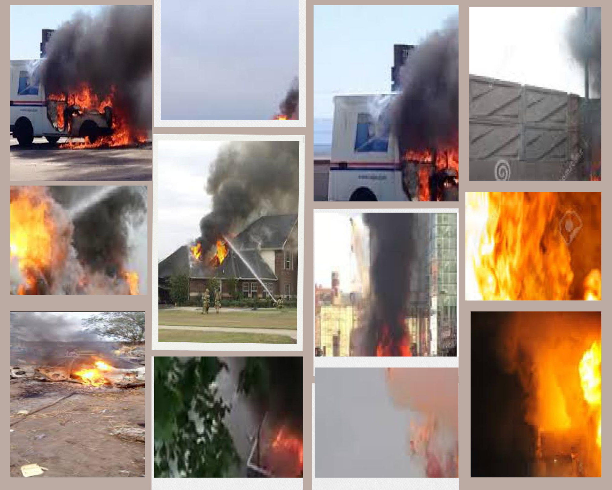

# Early Fire Signs Detection

## Smoke and fire detection

> An intelligent Early Fire Signs Detection system aimed at safeguarding people and facilities




## Overview 

Fire can be one of the most catastrophic disasters that can happen anywhere and cause major destruction. Fire hazards exist in all types of industrial buildings and business environments. Fire incident in the workplace not only accounts for a large number of injuries but also for downtime and running costs to repair the damage to the premises and machinery. A Fire hazard can be any material, action or condition that might cause a fire to start or can increase the severity of a fire. Industries can have many causes of fire, like electrical overloads, combustible materials, hot works like welding, paint booths, an imperfect preventive maintenance schedule or human errors, and if not carefully protected, these hazards can be really dangerous.  

Conventional heat detector-based fire warning systems cannot detect an early fire. Heat detectors only alert when the temperature of the surrounding environment reaches a certain level, and it doesn’t happen until fire spreads considerably, not leaving many opportunities to avoid the incident. Therefore, it is important to have an early fire signs detection method that would allow authorities to detect and put out fires before it goes out of control.  

To monitor and detect early signs of fire at workplaces, cameras can be used. 

## Vision AI-based monitoring 

Vision AI-based Model for Early Fire Signs Detection is designed to spot early signs of smoke and fire and helps save lives and mitigate damages caused by industry fires. We aim to create safe workplaces by offering innovative, reliable, flexible, and scalable solutions. 

To ensure accuracy and reliability, these camera-based monitoring services should be supplemented by effective practices to ensure and prevent fire hazards. Furthermore, workers working in different factory units should always be made aware of fire signs to look for. 


## Model Details 

### Dataset 

The dataset for this scenario is based on early fire detection algorithms that are currently in practice.  

The dataset is made up of images and videos gathered from varied sources. The dataset has been designed to ensure real-world situations. It has an even distribution of: 


- Different(indoor/outdoor) environments 
- Variations in foregroung objects including persons, equipments etc 
- Different lighting conditions
- Variations in weather conditions 
- Using security camera feeds 
- Multiple instances of fire and smoke 
- Variations in camera orientations 
- Classes considered for model building are smoke and fire
- Total number of images used was 63,055


### Model 

The model is based off of the YOLOv5 algorithm. The model is trained on a custom dataset of images and videos. The model is trained based on the above dataset compiled by our team. We intend to develop a model that generalizes well in real world situations. 

The model recorded the following performance metrics:

|Precision|	Recall	|mAP50	|
|---------|---------|-------|
|58.7%	  |83.4%    |78.1%  |

The model is adaptable enough to run on any edge computing device.


### Scenario details

The business logic for this scenario is as follows: 

- We use existing camera feeds from the premises to monitor the early signs of fire in the workplace to ensure the safety of human lives in the workplace. 
- VisionAI system is able to run on edge devices. It uses camera feeds for processing. 
- We detect the presence of smoke and fire in the camera feed. 
- An alarming system is inplace as part of early fire signs detection solution.


## Try it now

### Quick method - using your local web-cam


To test this model & scenario, you can use the following steps:

- Install the visionai package from PyPI

<div class=termy>

```console
$ pip install visionai
---> 100%
```
</div>

- Test the scenario from your local web-cam

<div class=termy>

```console
$ visionai scenario test smoke-and-fire-detection

Downloading models for scenario: smoke-and-fire-detection
Model: smoke-and-fire-detection: https://workplaceos.blob.core.windows.net/models/yolov5s-people/yolov5s-people-0.0.4.zip
---> 100%

Starting scenario: smoke-and-fire-detection..

```
</div>


- You should be able to see the events generated on your console window with somke and fire being detected within the camera field of view.


## Features: 
- Unparalleled Accuracy and faster detection
     - Visionify’s Early Fire Signs detection model is capable of detecting fire incidents at an outstanding accuracy of up to 98% and a detection speed of 36 FPS.
- Flexible and Scalable 
    - Visionify’s Early Fire Signs detection is an end-to-end solution that integrates seamlessly with your existing camera network and is ready to detect. It can fit any building size and is easily expandable by adding more IP cameras to the network. 
- Integrated Solution 
    - It is an integrated system combining surveillance and early fire signs detection in one system.
- Deployment Ready 
	- Our pre-trained AI models are ready for immediate industrial deployments
- Versatile Framework 
    - We offer flexibility in deployment; the model can operate at the Edge, in the cloud, or any self-hosted environment 
- Compatible 
    - Visionify’s Early Fire Signs detection model has a broad potential and can be efficiently used for indoor and outdoor applications. 
- Privacy Protection
    - We understand your concerns about data privacy and take a proactive approach to preserve it. Our models are privacy oriented by design.


## Training with custom data

The scenario is provided as part of our GPL-v3 Open-Source package for VisionAI. If you wish to train this with custom datasets, please contact us and we can provide you with the training code. You can do custom training with your own datasets for free, as long as it complies with GPLv3 license (you give back the code to the community). If you are interested in a custom license, please (contact us)[contact.md].


## Contact Us

- For technical issues, you can open a Github issue [here](https://github.com/visionify/visionai).
- For business inquiries, you can contact us through [our website](https://visionify.ai/contact).